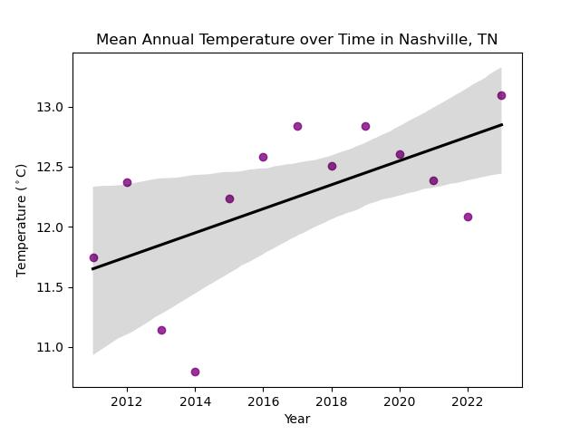

### Alexa Papanikolaou 
This is a page for assignments in the Earth Data Analytics program at CU Boulder

This is my dog, Meli!

  

 

**Bio:** Alexa works in Venture Development with the Venture Partners team at CU Boulder. She has  experience supporting university-based entrepreneurship, research commercialization and venture development, combined with a background in social and environmental impact assessment. Alexa is passionate about supporting innovation for impact, and her personal projects have spanned public transit equity research, community food sovereignty, agriculture tech, sustainable fashion tech and product lifecycle sustainability. Before joining CU Boulder, she earned her Bachelors from Vanderbilt University where she also worked at the Innovation Center, supporting regional entrepreneurial ecosystem development and led the annual Mid-South Innovation Summit, bringing together investors, founders and industry partners.

##### Contact Information
* Email address: alexa.papanikolaou@colorado.edu
* [Github Profile](https://github.com/alexapapanikolaou)
* [LinkedIn](https://www.linkedin.com/in/alexa-papanikolaou-29765410b/)

### Projects

### My First Map Assignment 
This is the example map of the Haskell Indian Nations University 
<embed type="text/html" src="img/haskell.html" width="600" height="600">

This is a map of the Cuyahoga Valley National Park near where I grew up in Ohio!
<embed type="text/html" src="img/CuyahogaValleyNationalPark.html" width="600" height="600">

This is a picture of the Cuyahoga Valley National Park.

          
Source: <a href="https://www.travelandleisure.com/thmb/-kEeVgtun3ErUY0kgi9eOYySi7g=/1500x0/filters:no_upscale():max_bytes(150000):strip_icc()/TAL-lead-image-CUYAHOGANP0425-c7aff5cabdaa45d4bed5709f8e26b4d1.jpg">
TravelandLeisure.com
</a>
</small>

## Temperature Data Project  
[View the full rendered html notebook here.](portfolio_posts/06-nashville-notebook.html)

**Nashville Temperature Interactive Plot**  
<embed type="text/html" src="img/nashville_annual_temp_interactive.html" width="600" height="600">

**Nashville Temperature Trendline Plot**  

  <em>Nashville Temperature Trendline Plot</em> 
  

The graphs above show the mean annual average temperature in Nashville, Tennessee, from 2011 to 2023. The temperature data were retrieved from NOAA’s National Centers for Environmental Information (NCEI) Daily Summaries dataset for weather station USC00406403. One important limitation is that these data represent only one weather station in the Nashville area, so they may not fully represent temperature patterns across the entire city. I focused on 2011–2023 because the earlier annual values in the dataset were missing. I also excluded 2024 because the dataset contained only one observation for that year, January 1, which produced an annual average of just 1.67°C and would have drastically skewed the trendline.
 
Across the available years, the trendline has a slope of approximately 0.10°C per year, which is about 1°C or 1.8°F per decade. This general warming trend is consistent with NOAA’s broader findings for Tennessee, which show that temperatures have increased by more than 2°F since the cooler period of the 1960s and that temperatures since 2010 have been near historically high levels in the state (Runkle, 2022).
 
- Since 2000, Tennessee has received 33 major disaster declarations involving severe storms and flooding. "Extreme weather events that frequently occur in Tennessee include severe thunderstorms, flooding, tornadoes, droughts, heat and cold waves, and winter storms" (Runkle, 2022).
- For example, in January, 2026 Winter Storm Fern brought one of the region's worst power outages and led 5 storm-related deaths in Nashville and 25 deaths across the state (Turner, 2026).
- According to The Science Times, "this extreme winter weather demonstrates precisely what scientists have been predicting for decades: a warming planet creates more volatile conditions, including paradoxically intense winter storms" (Soliman, 2026).
 
**Bibliography**
 
Runkle, J., K.E. Kunkel, D.R. Easterlng, L.E. Stevens, B.C. Stewart, R.
      Frankson, L. Romolo, J. Neilsen-Gammon, T.A. Joyner, W. Tollefson,
      (2022). Tennessee State Climate Summary 2022. NOAA Technical Report
      NESDIS 150-TN. NOAA/NESDIS. https://statesummaries.ncics.org/chapter/tn/?utm_source
 
Soliman, R. (2026, January 26). Why Winter Storm Fern actually proves climate
      change is Real—Not a hoax. Science Times. https://www.sciencetimes.com/articles/61201/20260126/why-winter-storm-fern-actually-provesclimate-change-realnot-hoax.htm
 
Turner, L., Wuot, P. G., & Marshall, A. (2026, February 20). Winter storm
      week 2: Challenges linger and some school districts remain closed.
      WPLN News.https://wpln.org/post/&storm-updates-ice-power-water-challenges-linger-after-a-week-as-deaths-climb-and-frustrations-rise/
